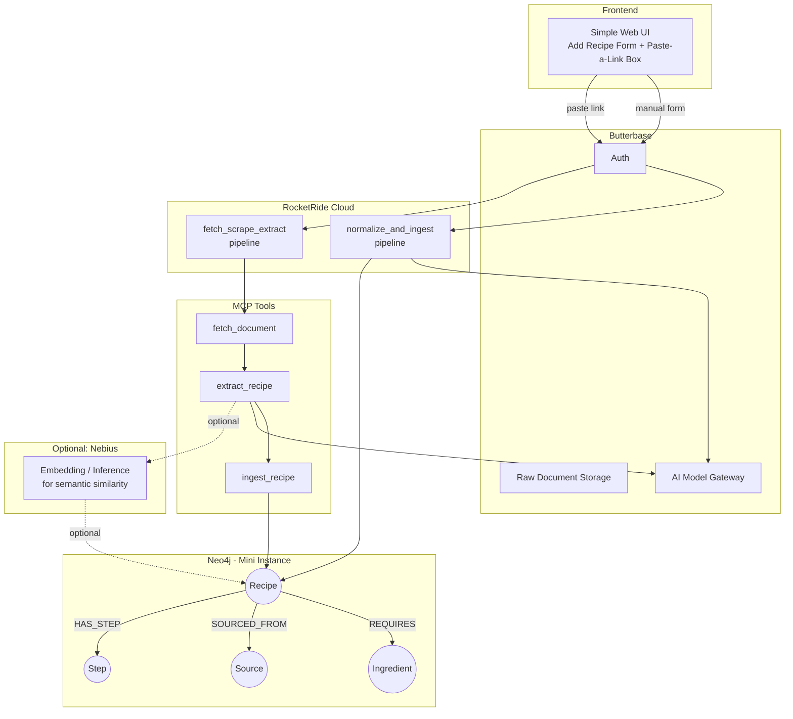

# 🍳 RecipeGraph — A Knowledge-Graph Recipe Agent

RecipeGraph is a simple, beginner-friendly agentic app for people who are new to cooking or eating out. Add recipes manually, or paste in a link (video, webpage, or document) and let the agent scrape and structure it for you. Everything lives in a knowledge graph, so the app can answer questions like *"what can I cook with what I have?"* or *"what recipes are similar to this one?"* — not just list rows in a table.

Built for **HackwithBay 3.0** — Theme: Building Graph-Aware Agentic Applications.

---

## ✨ Features

- **Add a recipe manually** with five simple fields: `Recipe Name`, `Author`, `Ingredients`, `Recipe Steps`, `Recipe Links`
- **Paste a link and auto-extract** — the agent fetches a video, webpage, or document, scrapes it, and turns it into a structured recipe automatically via MCP tools
- **Ingredient-aware recommendations** — ask "what can I make tonight?" and the agent traverses the graph to find recipes matching what you already have
- **Similarity discovery** — find recipes that share ingredients or sources with one you like
- **Simple by design** — no complex tagging, no manual categorization; the graph does the organizing for you

---

## 🏗️ Infrastructure Graph



### How data flows

1. **Manual entry**: User fills the form → Butterbase validates & authenticates → `normalize_and_ingest` pipeline (RocketRide Cloud) splits ingredients, dedupes them, and writes nodes/relationships into Neo4j.
2. **Link/document entry**: User pastes a URL or uploads a file → `fetch_scrape_extract` pipeline runs three MCP tools in sequence — `fetch_document` (pulls raw content), `extract_recipe` (LLM call via Butterbase's model gateway turns it into structured data), `ingest_recipe` (writes into the same graph as the manual path).
3. Both paths **converge on the same Neo4j graph**, so querying and recommendations work identically regardless of how a recipe was added.

---

## 🕸 Neo4j Graph Model

```
(:Recipe {name, author, created_at})
(:Ingredient {name})
(:Source {url, type})     // type: "video" | "webpage" | "document"
(:Step {order, text})     // optional

(:Recipe)-[:REQUIRES {quantity, unit}]->(:Ingredient)
(:Recipe)-[:SOURCED_FROM]->(:Source)
(:Recipe)-[:HAS_STEP]->(:Step)
```

**Why this matters:** `Ingredient` nodes are shared across recipes rather than duplicated per-recipe. This is what enables real graph traversal — ingredient-overlap queries, "what can I make," and similarity search — instead of treating Neo4j as a flat lookup table.

---

## 🛠 Technology Stack

| Layer | Technology | Role |
|---|---|---|
| **Backend** | Butterbase | Auth, raw document storage, AI model gateway (unified access to LLMs for extraction) |
| **Graph Database** | Neo4j (Aura free tier / mini instance) | Stores recipes, ingredients, sources, and steps as a property graph; traversed for recommendations |
| **Pipeline Runtime** | RocketRide Cloud | Hosts `normalize_and_ingest` and `fetch_scrape_extract` as managed, production pipelines |
| **Agent Tooling** | MCP (`fetch_document`, `extract_recipe`, `ingest_recipe`) | Lets the agent autonomously scrape and structure external recipe sources |
| **Optional** | Nebius | Embedding/inference backend for semantic similarity search across scraped recipes (not part of the mandatory hackathon stack — bonus infra only) |
| **Frontend** | Simple web UI | Add-recipe form + paste-a-link box + results view |

---

## 🚀 How to Work / Test the System

### 1. Setup

```bash
# Clone the repo
git clone <your-repo-url>
cd recipegraph

# Install dependencies
npm install   # or pip install -r requirements.txt, depending on stack
```

- Sign up and provision a project at [dashboard.butterbase.ai](https://dashboard.butterbase.ai)
- Spin up a Neo4j Aura free-tier instance (or run Neo4j locally) and note your connection URI + credentials
- Build pipelines locally using the RocketRide VS Code extension before deploying

### 2. Configure environment variables

```env
BUTTERBASE_API_KEY=your_key_here
NEO4J_URI=neo4j+s://your-instance.databases.neo4j.io
NEO4J_USER=neo4j
NEO4J_PASSWORD=your_password
ROCKETRIDE_ENDPOINT=https://cloud.rocketride.ai/your-pipeline
NEBIUS_API_KEY=optional_if_used
```

### 3. Deploy the pipelines

- Build `normalize_and_ingest` and `fetch_scrape_extract` locally in the RocketRide VS Code extension
- Test both pipelines locally first
- One-click deploy each to **cloud.rocketride.ai** — a local-only pipeline does not satisfy the deployment requirement

### 4. Run the app locally

```bash
npm run dev   # or your equivalent start command
```

Visit `http://localhost:3000` and you should see the Add Recipe form and the Paste-a-Link box.

### 5. Test — Manual recipe path

1. Fill in a recipe: name, author, a few ingredients, steps, and a link
2. Submit and confirm it appears in Neo4j:

```cypher
MATCH (r:Recipe)-[:REQUIRES]->(i:Ingredient)
RETURN r.name, collect(i.name)
```

### 6. Test — Scrape/link path

1. Paste a real recipe URL (webpage or video) into the paste-a-link box
2. Confirm the MCP chain runs end-to-end: `fetch_document → extract_recipe → ingest_recipe`
3. Check Neo4j for the new `(:Recipe)` node and its `(:Source)` relationship

### 7. Test — "What can I cook?" query

Seed a small pantry list, then run:

```cypher
MATCH (r:Recipe)-[:REQUIRES]->(i:Ingredient)
WHERE i.name IN $pantry_items
WITH r, count(i) AS matches, size((r)-[:REQUIRES]->()) AS total
WHERE matches >= total - 1
RETURN r.name, matches, total
ORDER BY matches DESC
```

This should return recipes where you're missing at most one ingredient — the core "productivity" payoff of the app.

### 8. Smoke-test checklist before demo/submission

- [ ] Manual recipe form writes correctly to Neo4j
- [ ] Pasted link produces a correctly structured recipe via MCP tools
- [ ] Both pipelines are deployed and running on RocketRide Cloud (not local-only)
- [ ] Butterbase auth, storage, and model gateway are all actively in use
- [ ] "What can I cook?" query returns sensible results against seeded data
- [ ] (Optional) Nebius-powered similarity search returns reasonable matches

---

## 📦 Submission Notes

- **Problem**: Beginners to cooking don't know what they can make with what they have, and manually organizing recipes from scattered sources (videos, webpages, docs) is tedious.
- **Graph model**: See the Neo4j section above — Recipe/Ingredient/Source/Step nodes with shared Ingredient nodes enabling traversal.
- **Butterbase**: Auth, storage, and model gateway all in active use.
- **RocketRide Cloud**: Two production pipelines deployed and callable from the app.
- **Neo4j**: Actively queried for recommendations, not just storage.
- **Optional**: Nebius used for embedding-based similarity search (bonus infra, outside mandatory hackathon stack).