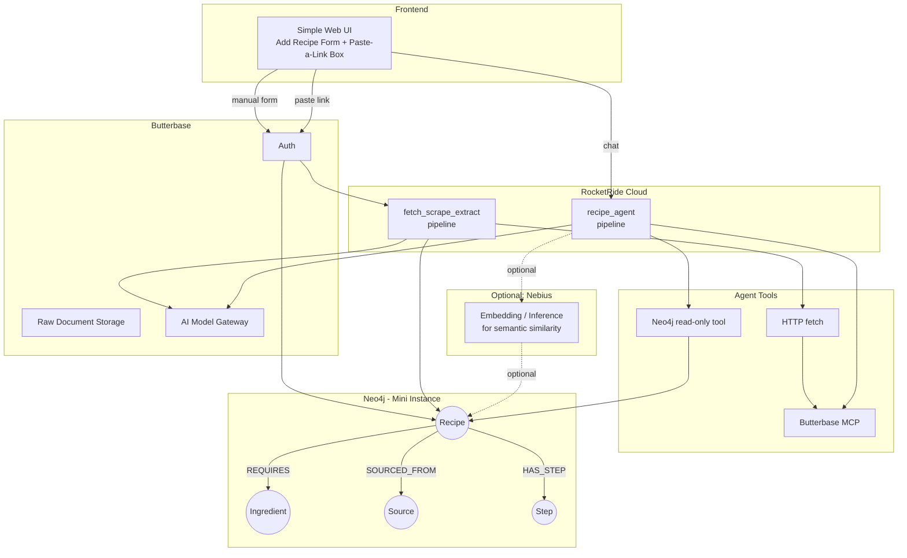

# 🍳 bepgraph — A Knowledge-Graph Recipe Agent

bepgraph is a simple, beginner-friendly agentic app for people who are new to cooking or eating out. Add recipes manually, or paste in a link (video, webpage, or document) and let the agent scrape and structure it for you. Everything lives in a knowledge graph, so the app can answer questions like *"what can I cook with what I have?"* or *"what recipes are similar to this one?"* — not just list rows in a table.

Built for **HackwithBay 3.0** — Theme: Building Graph-Aware Agentic Applications.

---

## ✨ Features

- **Add a recipe manually** with five simple fields: `Recipe Name`, `Author`, `Ingredients`, `Recipe Steps`, `Recipe Links`
- **Paste a link and auto-extract** — the agent fetches a video, webpage, or document, scrapes it, and turns it into a structured recipe automatically via MCP tools
- **Ingredient-aware recommendations** — ask "what can I make tonight?" and the agent traverses the graph to find recipes matching what you already have
- **Similarity discovery** — find recipes that share ingredients or sources with one you like
- **Simple by design** — no complex tagging, no manual categorization; the graph does the organizing for you

---

## 🏗️ Infrastructure Graph



### How data flows

1. **Manual entry**: User fills the form → backend normalizes the recipe → writes recipe, ingredient, source, and step nodes into Neo4j.
2. **Link/document entry**: User pastes a URL → `fetch_scrape_extract.pipe` fetches the source, uses Butterbase GPT-5 Nano to produce structured recipe JSON, then the backend saves it through the same Neo4j/file database path.
3. **Agent chat**: User asks what to cook → `recipe_agent.pipe` uses Butterbase GPT-5 Nano plus the Neo4j read-only tool to retrieve graph context and answer with source-aware recommendations.

---

## 🕸 Neo4j Graph Model

```
(:Recipe {name, author, created_at})
(:Ingredient {name})
(:Source {url, type})     // type: "video" | "webpage" | "document"
(:Step {order, text})     // optional

(:Recipe)-[:REQUIRES {quantity, unit}]->(:Ingredient)
(:Recipe)-[:SOURCED_FROM]->(:Source)
(:Recipe)-[:HAS_STEP]->(:Step)
```

**Why this matters:** `Ingredient` nodes are shared across recipes rather than duplicated per-recipe. This is what enables real graph traversal — ingredient-overlap queries, "what can I make," and similarity search — instead of treating Neo4j as a flat lookup table.

---

## 🗂 Local Recipe Database File

The app includes a local expandable database file at `data/recipes.json`. It is useful for early development, API imports, and demos before Neo4j is configured.

Each recipe stores:

- `name`: food or menu item name
- `author`: creator, website author, or imported source author
- `ingredients`: ingredient objects with `name`, optional `quantity`, and optional `unit`
- `steps`: ordered recipe instructions
- `sources`: original article, video, API, or document reference links
- `owner_user_id`: who owns or maintains the recipe
- `created_at` / `updated_at`: audit timestamps

The file has two expandable sides:

1. User-maintained data: users can add recipes, update menu items, fix ingredients, and edit recipe steps through API routes.
2. Imported data: the backend can fetch recipe pages or external APIs, extract structured recipe data, and save it into the same recipe shape.

Current local backend routes:

```text
GET   /api/recipes
POST  /api/recipes
PATCH /api/recipes/:id
POST  /api/recipes/from-link
POST  /api/graph/query
```

`POST /api/recipes/from-link` first tries to scrape `Recipe` JSON-LD from recipe article pages. Many recipe websites expose this structured metadata for search engines. If a page does not expose Recipe JSON-LD, the backend stores an import draft so the Butterbase/RocketRide extraction pipeline can process it later.

For production, keep Neo4j as the source of truth and treat `data/recipes.json` as a development seed/cache. The shape intentionally mirrors the graph model so recipes can be migrated into `(:Recipe)-[:REQUIRES]->(:Ingredient)`, `(:Recipe)-[:HAS_STEP]->(:Step)`, and `(:Recipe)-[:SOURCED_FROM]->(:Source)`.

---

## 🛠 Technology Stack

| Layer | Technology | Role |
|---|---|---|
| **Backend** | Butterbase | Auth, raw document storage, AI model gateway (unified access to LLMs for extraction) |
| **Graph Database** | Neo4j (Aura free tier / mini instance) | Stores recipes, ingredients, sources, and steps as a property graph; traversed for recommendations |
| **Pipeline Runtime** | RocketRide Cloud | Hosts `fetch_scrape_extract` and `recipe_agent` as managed, production pipelines |
| **Agent Tooling** | MCP (`fetch_document`, `extract_recipe`, `ingest_recipe`) | Lets the agent autonomously scrape and structure external recipe sources |
| **Optional** | Nebius | Embedding/inference backend for semantic similarity search across scraped recipes (not part of the mandatory hackathon stack — bonus infra only) |
| **Frontend** | React + Vite | Agent chat, add-recipe form, paste-a-link import, graph query preview, and saved recipe library |

---

## 🚀 How to Work / Test the System

### 1. Setup

```bash
# Clone the repo
git clone <your-repo-url>
cd bepgraph

# Install dependencies
npm install   # or pip install -r requirements.txt, depending on stack
```

- Sign up and provision a project at [dashboard.butterbase.ai](https://dashboard.butterbase.ai)
- Spin up a Neo4j Aura free-tier instance (or run Neo4j locally) and note your connection URI + credentials
- Build pipelines locally using the RocketRide VS Code extension before deploying

### 2. Configure environment variables

```env
BUTTERBASE_API_KEY=your_key_here
BUTTERBASE_API_URL=https://api.butterbase.ai
BUTTERBASE_AI_MODEL=openai/gpt-5-nano
# Optional: set this for app-scoped Butterbase AI calls.
BUTTERBASE_APP_ID=
NEO4J_URI=neo4j+s://your-instance.databases.neo4j.io
NEO4J_USER=neo4j
NEO4J_PASSWORD=your_password
ROCKETRIDE_APIKEY=your_rocketride_api_key
ROCKETRIDE_URI=https://api.rocketride.ai
ROCKETRIDE_PIPE_FILE=pipelines/fetch_scrape_extract.pipe
ROCKETRIDE_CHAT_PIPE_FILE=pipelines/recipe_agent.pipe
ROCKETRIDE_TEST_INPUT=test-fixtures/recipe-link.json
# Optional only if you deploy a separate HTTP endpoint instead of running .pipe files through the SDK.
ROCKETRIDE_ENDPOINT=
SPOONACULAR_API_KEY=your_spoonacular_key
SPOONACULAR_API_URL=https://api.spoonacular.com
NEBIUS_API_KEY=optional_if_used
```

Copy `.env.example` to `.env` for local development and fill in your real values.

The agent chat endpoint uses Butterbase's OpenAI-compatible AI gateway when `BUTTERBASE_API_KEY` is set. By default it calls `openai/gpt-5-nano` through:

- App-less mode: `POST /v1/chat/completions`
- App-scoped mode: `POST /v1/{BUTTERBASE_APP_ID}/chat/completions` when `BUTTERBASE_APP_ID` is set

If Butterbase AI is not configured or the gateway call fails, the backend falls back to local recipe matching so the app remains usable.

### 2.2 External Recipe APIs

Spoonacular recipes are normalized into the same internal database shape as manual recipes and scraped recipe pages before saving. That is the unification point: every provider becomes `{name, author, ingredients, steps, sources, provider, external_id}` before it is written to `data/recipes.json` or Neo4j.

Current Spoonacular routes:

```text
GET  /api/providers/spoonacular/search?query=pasta&number=10
POST /api/providers/spoonacular/recipes/:id/save
```

The save route fetches `GET /recipes/{id}/information` from Spoonacular, converts `extendedIngredients`, `analyzedInstructions`, `sourceUrl`, and author/source fields into the bepgraph recipe structure, then saves through the same database path used by user-created recipes.

### 2.1 Butterbase MCP for Codex

This repo includes a project-scoped Codex MCP config at `.codex/config.toml`:

```toml
[mcp_servers.butterbase]
url = "https://api.butterbase.ai/mcp"
bearer_token_env_var = "BUTTERBASE_API_KEY"
```

If `codex mcp add ...` returns `zsh: command not found: codex`, your terminal does not have the Codex CLI on `PATH`. In this environment, the binary was found at:

```bash
/Users/hunghoanggia/.vscode/extensions/openai.chatgpt-26.623.141536-darwin-arm64/bin/macos-aarch64/codex
```

You can either use that full path, add its folder to your shell `PATH`, or keep using the checked-in `.codex/config.toml`. Restart Codex after setting `BUTTERBASE_API_KEY` so the Butterbase MCP tools are loaded.

### 3. Deploy the pipelines

- Build `fetch_scrape_extract` and `recipe_agent` locally in the RocketRide VS Code extension
- Test both pipelines locally first
- One-click deploy each to **cloud.rocketride.ai** — a local-only pipeline does not satisfy the deployment requirement

Pipeline contract for this app:

```text
fetch_scrape_extract
Input:  { url, model: "openai/gpt-5-nano" }
Output: { recipe, ingredients, steps, sources }

recipe_agent
Input:  chat question with pantry/context
Output: recipe recommendation using Neo4j graph context
```

The extraction and recipe agents call Butterbase AI through the model gateway using `BUTTERBASE_AI_MODEL=openai/gpt-5-nano`. When `ROCKETRIDE_APIKEY` is present, `/api/agent/chat` runs `ROCKETRIDE_CHAT_PIPE_FILE` through RocketRide first. If RocketRide is unavailable, the backend falls back to direct Butterbase chat, then local matching.

Test commands:

```bash
# Directly test Butterbase AI model quality
npm run test:butterbase -- "Return a JSON recipe for tofu fried rice"

# Confirm RocketRide credentials and list available services
npm run test:rocketride:services

# Run a local .pipe file with a JSON recipe-link input
npm run test:rocketride:pipe

# Test a chat/agent pipeline using RocketRide Question + Answer.parseJson
npm run test:rocketride:agent -- "Recommend dinner from rice, tofu, spinach, garlic"
```

Use the RocketRide IDE extension to create or open `.pipe` files in `pipelines/`. The TypeScript SDK runs them with `client.use({ filepath: "pipelines/fetch_scrape_extract.pipe" })`, sends input with `client.send(...)`, streams larger input with `client.pipe(...)`, and tests agent/chat behavior with `client.chat({ token, question })`.

### 4. Run the app locally

```bash
npm install
npm run dev
```

This starts the Express backend on `http://localhost:8787` and the React app on `http://localhost:3000`. Visit `http://localhost:3000` and you should see the bepgraph React app with Agent, Recipe Recreational, and Graph Data tabs.

### 5. Test — Manual recipe path

1. Fill in a recipe: name, author, a few ingredients, steps, and a link
2. Submit and confirm it appears in Neo4j:

```cypher
MATCH (r:Recipe)-[:REQUIRES]->(i:Ingredient)
RETURN r.name, collect(i.name)
```

### 6. Test — Scrape/link path

1. Paste a real recipe URL (webpage or video) into the paste-a-link box
2. Confirm the MCP chain runs end-to-end: `fetch_document → extract_recipe → ingest_recipe`
3. Check Neo4j for the new `(:Recipe)` node and its `(:Source)` relationship

### 7. Test — "What can I cook?" query

Seed a small pantry list, then run:

```cypher
MATCH (r:Recipe)-[:REQUIRES]->(i:Ingredient)
WHERE i.name IN $pantry_items
WITH r, count(i) AS matches, size((r)-[:REQUIRES]->()) AS total
WHERE matches >= total - 1
RETURN r.name, matches, total
ORDER BY matches DESC
```

This should return recipes where you're missing at most one ingredient — the core "productivity" payoff of the app.

### 8. Smoke-test checklist before demo/submission

- [ ] Manual recipe form writes correctly to Neo4j
- [ ] Pasted link produces a correctly structured recipe via MCP tools
- [ ] Both pipelines are deployed and running on RocketRide Cloud (not local-only)
- [ ] Butterbase auth, storage, and model gateway are all actively in use
- [ ] "What can I cook?" query returns sensible results against seeded data
- [ ] (Optional) Nebius-powered similarity search returns reasonable matches

---

## 📦 Submission Notes

- **Problem**: Beginners to cooking don't know what they can make with what they have, and manually organizing recipes from scattered sources (videos, webpages, docs) is tedious.
- **Graph model**: See the Neo4j section above — Recipe/Ingredient/Source/Step nodes with shared Ingredient nodes enabling traversal.
- **Butterbase**: Auth, storage, and model gateway all in active use.
- **RocketRide Cloud**: Two production pipelines deployed and callable from the app.
- **Neo4j**: Actively queried for recommendations, not just storage.
- **Optional**: Nebius used for embedding-based similarity search (bonus infra, outside mandatory hackathon stack).
